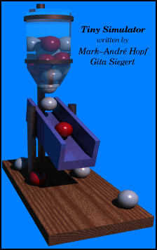
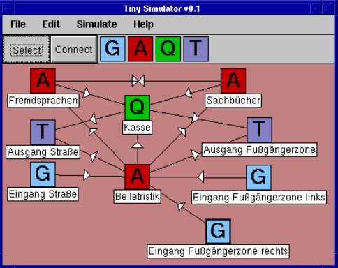

# Tiny Simulator v0.1 alpha

# 1 Einleitung

## 1.1 Aufgabenstellung

Tiny Simulator entstand als Praktikumsarbeit zur Vorlesung 
Modulation/Simulation am Fachbereich Informatik der Universität Rostock zu der Aufgabenstellung

> Entwickeln Sie ein einfaches Simulationslaufzeitsystem das nach der aktivitätsorientierten Strategie arbeitet.
Testen Sie Ihr Programm mit einem geeigneten Beispielmodell.

Mit Tiny Simulator lassen sich einfache Modelle von Bediensystemen zeichnen und anschließend simulieren.

## 1.2 Mängel und was man noch ergänzen könnte

* XACTs und Komponenten könnten eine Statistik führen.
* Der Report könnte graphisch aufbereitet werden.
* Die Warteschlange sollte zur Freigabe keine Verzögerung benutzen sondern sich nach den Folgekomponenten richten.
* Start und Endzeit sollten frei wählbar sein. (Derzeit zwischen 0 und 200.)
* Makrosprache (z.B. GNU Guile) zur Definition komplexer Vorgänge.
* Die Gewichte der Verbindungen zu einer Komponente müßten der Übersichtlichkeit halber in einem Fenster gleichzeitig editierbar sein.
* Die Verbindungen müßten ihre Gewichte anzeigen.
* Gruppieren von Komponenten und Verbindungen, so daß diese objekt-orientiert geschachtelt werden können.
* Animierte Simulation.
* Scrollbalken im Editorfenster.
* Druckausgabe.
* und so weiter...

## 1.3 Hilfsmittel

Zur Realisierung dieses Pro jekts wurde folgende Software verwendet:
* GNU/Linux 2.0.33
* XFree86 3.2
* GNU C++ Compiler 2.7.2.2
* TOAD 0.0.33
* POV-Ray 3.0
* The GIMP 0.99.14
* XV 3.10a
* LATEX2e
* dvips
* JOE 2.8

# 2 Benutzung

## 2.1 Arbeitsweise des Simulators

Man zeichnet mehrere Komponenten und verbindet diese anschließend. Wird die Simulation gestartet, so erzeugen einige Komponenten sogenannte XACTs, welche dann die Verbindungen entlangwandern, bis sie schließlich wieder vernichtet werden.

## 2.2 Erstellen einer Simulation

### 2.2.1 Einfügen von Komponenten

Bewegen Sie die Maus auf eine der Komponenten G, Q, A oder T in der Toolbar, drücken Sie die mittlere Maustaste und ziehen Sie sie auf die Zeichenfläche.

### 2.2.2 Verbinden von Komponenten

Wählen Sie zunächst den Toolbutton _Connect_ mit der linken Maustaste.
Nun können Sie Verbindungen erstellen indem Sie ein Startsymbol auswählen und von dort aus mit der gedrückten linken Maustaste die Verbindung zum Zielsymbol ziehen und über diesem fallen lassen.

### 2.2.3 Verschieben von Komponenten

Wählen Sie den Toolbutton _Select_ und verschieben Sie die Komponente durch Greifen linken Maustaste.

### 2.2.4 Editieren von Eigenschaften

Die Eigenschaften der Symbole und Verbindungen lassen sich durch Drücken der rechten Maustaste editieren.

## 2.3 Beschreibung der Komponenten

**Generate** Erzeugt in einem bestimmten Zeitrythmus XACTS, welcher durch eine Dauer (Duration) +/- einen Radius (Range) angegeben ist.

**Terminate** Vernichtet XACTS und besitzt keine weiteren Eigenschaften.

**Advance** Verzögert das Weiterreichen von XACTs um eine bestimmte Dauer.

**Queue** Eine First-In-First-Out Warteschlange mit Verzögerung. Das älteste XACT wird die angegebene Dauer verzögert. Wenn es anschließend die Queue verläßt rückt das danach eingetroffene XACT auf und wird ab diesem Zeitpunkt verzögert.

**Verbindung** Jeder Verbindung ist ein Gewicht zugeordnet, mit welcher Wahrscheinlichkeit sie gewählt wird, wenn ein XACT die dem Pfeil der Verbindung abgewandte Komponente verläßt.

Alle Gewichte einer Komponente verlassenden Verbindungen müssen sich zu 1.0 addieren.

Sollte dies nicht der Fall sein, wird jedes Gewicht durch die Summe aller Gewichte geteilt. Der Wert jedes einzelnen Gewichts sollte ab er trotzdem unter 1.0 bleiben, da es evtl. Probleme gibt beim Speichern und anschlieenden Laden.

# 3 Programminterna

## 3.1 Arbeitsweise der Komponenten

**TShapeGenerator** Beim Start der Simulation wird für jeden Generator eine `TActWait` Aktivität registriert. Ist diese Aktivität beendet so wird ein neues XACT erzeugt, an eine der Folgekomponenten weitergegeben und und eine neue `TActWait` für diese Komp onente registriert.

**TShapeTerminator** Vernichtet XACTS und erzeugt keine weiteren Aktivitäten.

**TShapeAdvance** Für jedes eintreffende XACT wird eine `TActWait` Aktivität registriert und in dieser das betreffende XACT notiert.

Ist die Aktivität beendet, so gibt die Komponente das XACT an eine der Folgekomponenten weiter.

**TShapeQueue** Für jedes eintreffende XACT wird eine `TActQueueWait` Aktivität registriert. Sobald diese gestartet ist, setzt sie in der Queue ein Flag, so daß alle anderen für diese Komponente registrierten `TActQueueWait` Aktivitäten bei der Anfrage an `Ready()` mit `false` antworten.

Ist die laufende Aktivität beendet, löscht sie das Flag und gibt somit die nächste anstehende Aktivität für die Queue frei.

## 3.2 Implementierung
Die für die Simulation nötigen Datenstrukturen und Algorithmen finden sich in den Dateien:

**Simulate.??** Simulationsalgorithmus

**Act.??** Aktivitäten

**Shape.??** Komponenten

Zum leichteren Verständnis sind die Klassen und Funktionen nicht alphabetisch, sondern nach der Klassenhierachie und Abhängigkeiten geordnet und es werden nur die simulationsspezifischen Eigenschaften erklärt:

## Globale Funktionen

### void Simulate(TShapeBuffer&, TConnectionBuffer&)

Der Simulationsalgorithmus nach der aktivitätsorientierten Strategie.

### TTime Clock()

Liefert die aktuelle Uhrzeit der Simulation zurück.

### void Add2Boundlist(TAct*)
Fügt der Liste der gebundenen Aktivitäten eine neue hinzu.

## class TAct

Die Basisklasse aller Aktivitäten.

### virtual bool Ready()

Gibt `true` zurück wenn die Aktivität gestartet werden soll.

### virtual void Start() = 0

Muß das `end` Attribut auf den Zeitpunkt setzen, zu dem die Aktivität beendet werden soll.

Diese sollte nicht kleiner als der von `Clock()` gelieferte Wert sein, ansonsten läuft die Zeit rückwärts.

### virtual void End()

Wird aufgerufen, wenn `now` gleich `end` ist. Danach wird das Objekt gelöscht.

### void Bind()
Wenn während `End()` diese Funktion aufgerufen wird, dann wird die Aktivität nicht gelöscht sondern erneut benutzt, was sich aus Performancegründen gelegentlich anbietet.

## class TShape

Die Komponenten in der aktivitätsorientierten Strategie sowie deren graphische Repräsentation.

### void Send(Txact)

Ruft `recv` in einem der angebundenen Shap es auf. Welches Shape die Benachrichtigung erhält ist vom Zufall und den der Vebindungen zugeordneten Wahrscheinlichkeiten abhängig.

### virtual void recv(Txact)
Wird von Send aufgerufen, wenn ein XACT über er eine Verbindung eingetroffen ist.
